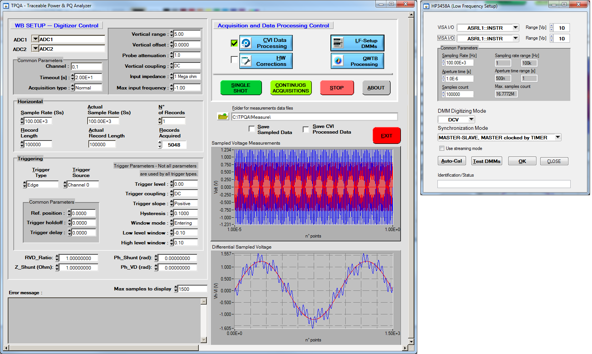
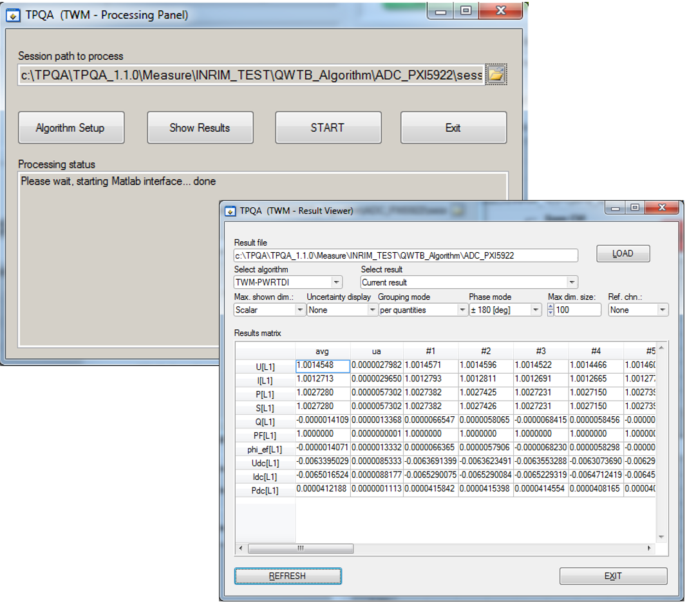
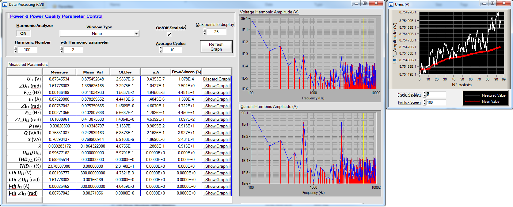

# TPQA-Traceable Power & Power Quality Analyzer

TPQA is being developed at  power and distorted signals primary laboratories of [INRIM](https://www.inrim.it/ricerca-sviluppo/laboratori-di-ricerca/metrologia-elettrica), belonging to the Quantum Metrology and Nanotechnology Division, in the framework of [EMPIR](https://msu.euramet.org/calls.html) project [TracePQM](http://tracepqm.cmi.cz/). It looks like as an open software tool project used for handling high performance and precise state-of-the-art sampling system identified for building of metrology grade measurement system suitable to ensure reliable and traceable measurement of Power and Power Quality (PQ) complex parameters. 

Its use is not only restricted to power and energy area, but it can be used in experiments which require simultaneous measurement of complex voltage and current waveforms coming from diferent types of scaling transducers or generated from both non-quantum and quantum waveforms synthesizers.  

It has been developed using an ANSI c development environment such as [LabWindows/CVI](http://www.ni.com/lwcvi/whatis/hardware/), and  its  modularity is based on the following components:

 - Guide user interface (GUI) that hosts a control and data acquisition module optimized to operate with different hardware platforms.
 - Data processing module that allows to interact with the calculation scripts using the [Matlab](https://uk.mathworks.com/products/matlab.html) engine for post-processing or through the [Advanced Analysis Libraries](http://zone.ni.com/reference/en-XX/help/370051AC-01/cvi/libref/cviadvanced_analysis_library_functi/) of the development environment for
on-line computation of main power and PQ electrical parameters.

TPQA handles the following digitizers using suitable drivers as:

 - [niScope](http://sine.ni.com/nips/cds/view/p/lang/cs/nid/12638) drivers for control of single or multiple PXI-5922 24-bit flexible resolution digitizer whose bandwidth falls within the medium frequency (MF) of radio frequency band.
 - Synchronized [HP/Agilent/Keysight3458A](https://www.keysight.com/en/pd-1000001297%3Aepsg%3Apro-pn-3458A/digital-multimeter-8-digit?cc=US&lc=eng) configured as  digitizer by making DC voltage measurements, by DCV digitizing, by direct-sampling, or by sub-sampling.

The post-processing of Power and PQ parameters is performed by the [QWTB](https://qwtb.github.io/qwtb/)
toolbox. A list of supported algorithms can be found in the following report: [Algorithms Description](https://github.com/smaslan/TWM/blob/master/doc/A244%20Algorithms%20description.pdf).

The project is still under development. The current version includes the guide user interfaces (GUIs) trought which one can beging to gain experience with high performance digitizers and waveform sampling. The following actions can be performed:

- In the present release it is possibile to perform single shot or continous acquisition with measurement system equiped with a single or two PXI-5922 boards configured for single-ended or pseudo-differential measurements of pure and distorted waveforms. 
- Sampling waveforms using two DMMs 3458A configured as Master-Slave.

- Post-processing of sampled data (only for TPQA release under LabWindows/CVI environment) using the concept of Matlab to CVI interface similar to that developed for [TWM](https://github.com/smaslan/TWM). 

- On-line processing of recorded data and analysis in the frequency domain using the Advanced Analysis Library provided by LabWindows/CVI. 

## Download

Here you can download build only:

## License
The TPQA is distributed under [MIT license](./LICENSE.md/LICENSE.md). Note the algorithms in the QWTB toolbox may have different licenses.

